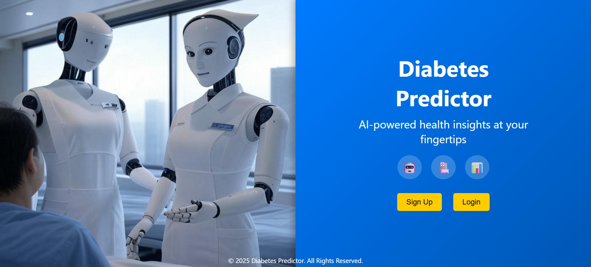
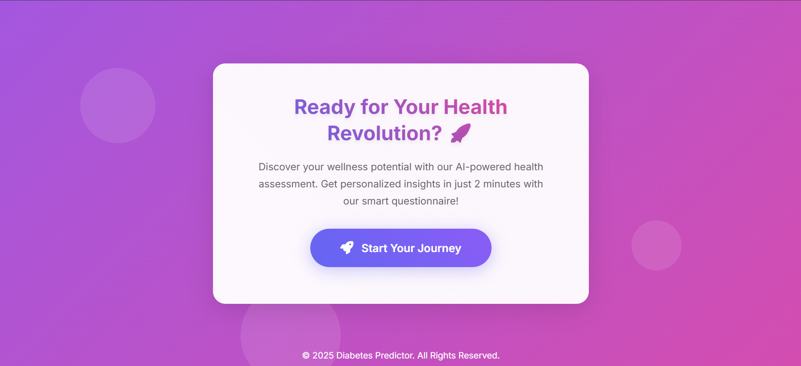
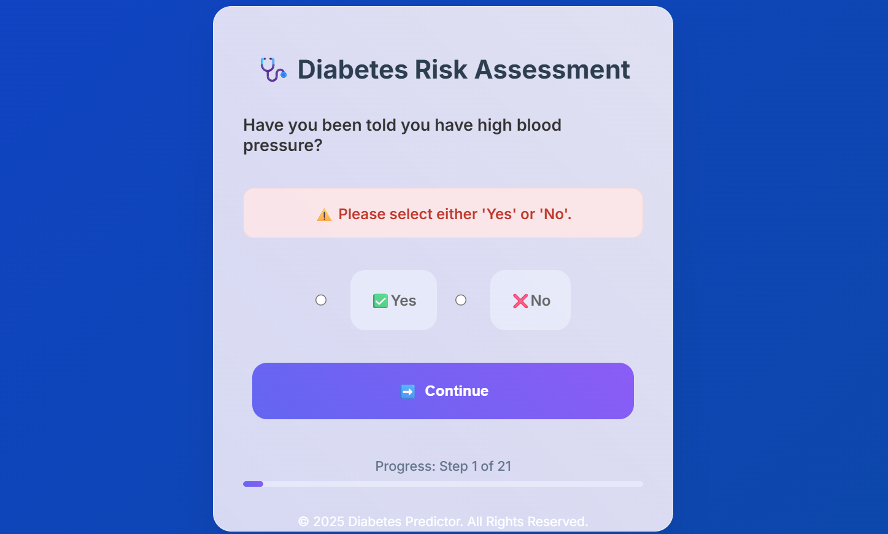
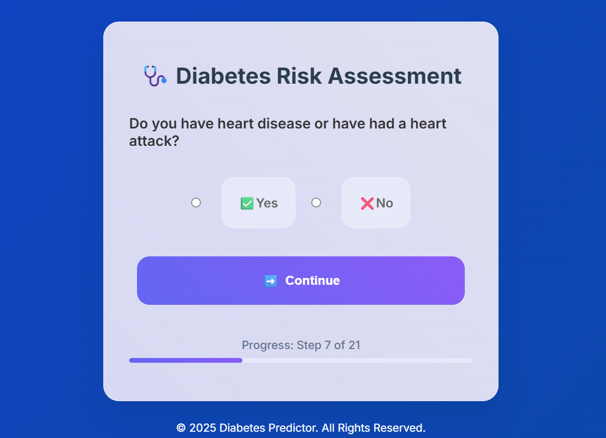
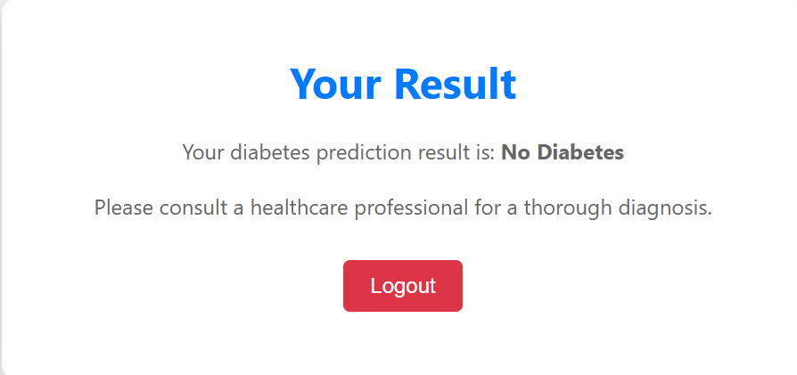
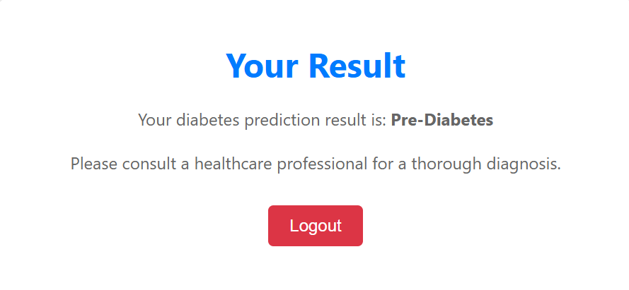
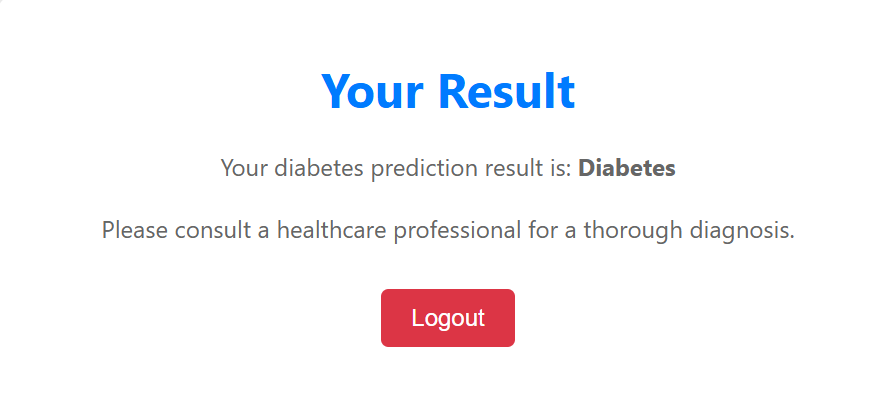
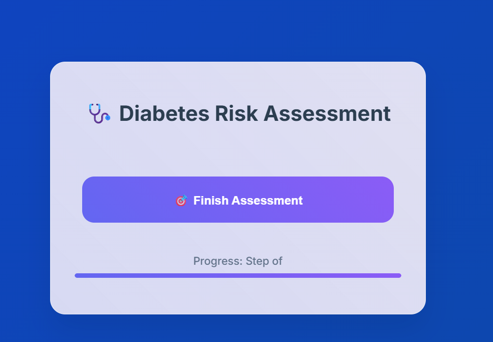

# 🩺 Diabetic Predictor

A production-grade Django-based web app that predicts whether a user is **Diabetic**, **Pre-Diabetic**, or **Non-Diabetic** based on healthcare and lifestyle inputs. The backend is powered by an optimized **Ensemble Machine Learning Model** combining **CatBoost**, **XGBoost**, and **LightGBM**, trained on a large real-world medical dataset.

---

## 📊 Dataset

**Source:** [CDC Diabetes Health Indicators Dataset (UCI)](https://archive.ics.uci.edu/dataset/891/cdc+diabetes+health+indicators)

- **Records:** 253,680 entries  
- **Features:** 35 total (22 selected for prediction)  
- **Target Variable:** `Diabetes_012`  
  - 0 = No Diabetes  
  - 1 = Pre-Diabetes  
  - 2 = Diabetes  

---

## 🎯 Project Objective

To provide an accessible and intelligent diabetes screening tool for the general public that can:

- Collect user health and lifestyle indicators through a simple web interface
- Predict the likelihood of having diabetes using an advanced ML ensemble
- Support decision-making with high accuracy and transparency

---

## 🚀 Features

- 🧠 **ML Ensemble Model** using:
  - `CatBoostClassifier`
  - `XGBClassifier`
  - `LGBMClassifier`
- ⚖️ **Ensemble Weighting**
  - CatBoost: `0.780`
  - XGBoost: `0.102`
  - LightGBM: `0.118`
- 🔍 **Threshold Calibration**
  - Pre-Diabetes Threshold: `0.001`
  - Diabetes Threshold: `0.050`
- 📈 **Performance**
  - Accuracy: `89.6%`
  - ROC-AUC: `0.98`
  - F1-score (Class 2 - Diabetes): `0.95`
- 🖥️ **User Interface**
  - Step-by-step health questionnaire
  - Secure user login/signup
  - Final diagnosis view: `No Diabetes`, `Pre-Diabetes`, or `Diabetes`

---

## 🛠️ Tech Stack

| Area             | Tools / Frameworks                                  |
|------------------|------------------------------------------------------|
| Web Framework    | Django 5.1.3                                         |
| ML Models        | CatBoost, XGBoost, LightGBM                          |
| Preprocessing    | scikit-learn, imbalanced-learn, SMOTE, StandardScaler|
| Hyperparameter Tuning | Optuna                                      |
| Dataset          | CDC Diabetes Health Indicators Dataset (UCI)        |
| Language         | Python 3.11                                          |

---

## 🔍 App Walkthrough (Screenshots)

### 👤 Login Page

### 🧭 Home Screen

### ❓ Sample Questions

### ✅ Sample Results

### 🏁 Finish Screen

---

---

### 📬 Contact

For feedback, suggestions, or collaboration:

- 👤 **Syed Saad Ali**  
- 📧 Email: [syedsaadi427@gmail.com](mailto:syedsaadi427@gmail.com)  
- 🔗 GitHub: [@syedsaadali11](https://github.com/syedsaadali11)

---

